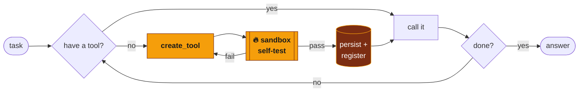

<div align="center">


<a href="https://github.com/MossLouvan/daedalus">
  <picture>
    <source media="(prefers-color-scheme: dark)" srcset="https://readme-typing-svg.demolab.com/?font=Fira+Code&weight=600&size=22&duration=3000&pause=900&color=F59E0B&center=true&vCenter=true&width=560&height=45&lines=Forges+its+own+tools;Boots+with+3+tools+%E2%80%94+builds+the+rest;Forge+%E2%86%92+Sandbox-test+%E2%86%92+Persist+%E2%86%92+Reuse;Python+%C2%B7+Claude+API" />
    <source media="(prefers-color-scheme: light)" srcset="https://readme-typing-svg.demolab.com/?font=Fira+Code&weight=600&size=22&duration=3000&pause=900&color=B45309&center=true&vCenter=true&width=560&height=45&lines=Forges+its+own+tools;Boots+with+3+tools+%E2%80%94+builds+the+rest;Forge+%E2%86%92+Sandbox-test+%E2%86%92+Persist+%E2%86%92+Reuse;Python+%C2%B7+Claude+API" />
    
  </picture>
</a>

<br>

[](https://www.python.org)
[](https://docs.anthropic.com)
[](#-verified)
[](LICENSE)
[](https://github.com/MossLouvan/daedalus/stargazers)

Most agents are stuck with the tools their author gave them. **Daedalus isn't.**<br>
It boots with three primitive file operations — and when a task needs a capability it
doesn't have, it **writes a new Python tool, tests it in a sandbox, and permanently
adds it to its own toolbox.** Every task it solves makes it permanently more capable.

</div>


> Inspired by the lifelong-learning idea behind [Voyager](https://arxiv.org/abs/2305.16291)
> — an agent that builds a skill library in Minecraft — reimagined as a clean,
> general-purpose tool-synthesis agent for arbitrary tasks, on the Anthropic Claude API.

## ✨ Why this is different

| Typical agent | 🪶 Daedalus |
|---|---|
| Fixed, hand-written tool set | **Grows its own tools at runtime** |
| Capabilities decided up front | **Capabilities discovered per task** |
| Generated code is throwaway | **Forged tools are tested → persisted → reused** |
| Black-box runs | **Every tool logged with the task that created it** |

The interesting part isn't "an LLM that writes code" — it's the **closed loop**: the
agent recognizes a capability gap, fills it, *verifies the fix in a sandbox*, and
carries the new capability forward into every future run.


## 🔁 How it works



1. **Boot** with three primitives: `read_file`, `write_file`, `list_dir`. Nothing
   computational — math, parsing, encoding, web access must all be forged.
2. **Reason.** Claude inspects the live toolbox and decides whether it can proceed.
3. **Forge.** When a capability is missing, it calls `create_tool` with the tool's
   name, schema, implementation, and a self-test.
4. **Verify.** The candidate runs in an isolated, timeout-bounded subprocess. If the
   self-test fails, the error goes back to Claude, which fixes it and retries.
5. **Persist & reuse.** Passing tools are saved to `tools_generated/` and registered
   live — callable on the very next turn and in every future run.


## 🚀 Quickstart

```bash
git clone https://github.com/MossLouvan/daedalus
cd daedalus
python -m venv .venv && source .venv/bin/activate
pip install -e .

export ANTHROPIC_API_KEY=sk-ant-...

# Give it a task it has no tool for:
daedalus "Compute the 30th Fibonacci number and tell me if it is prime."

# Inspect what it taught itself:
daedalus tools       # the current toolbox (primitive + forged)
daedalus history     # every tool ever forged + the task that triggered it
```


## 🧪 See the loop without an API key

`examples/demo_offline.py` drives the synthesizer directly — exactly the calls Claude
makes — so you can watch the **forge → test → fix → register → use** cycle for real:

```console
$ python examples/demo_offline.py

Boot toolbox: ['read_file', 'write_file', 'list_dir']

Forging a tool that fails its self-test (bad formula)...
  -> Tool 'compound_interest' FAILED its self-test and was NOT saved.

Retrying with the correct formula...
  -> Tool 'compound_interest' passed its self-test and is now in your permanent toolbox.

Toolbox now: ['read_file', 'write_file', 'list_dir', 'compound_interest']
Calling the forged tool:
  compound_interest(2000, 0.07, 10) = 3934.3
```

A buggy tool is **rejected by its own test**, the agent corrects it, and the fixed
tool becomes a permanent, callable capability. ✅


## 🛠️ Anatomy of a forged tool

<details>
<summary><b>Each accepted tool is written to <code>tools_generated/&lt;name&gt;.py</code> with provenance</b></summary>

<br>

```python
"""Auto-generated by Daedalus on 2026-06-16T12:00:00+00:00.

Forged to satisfy the task:
  compute compound interest
"""

SCHEMA = {
    "name": "compound_interest",
    "description": "Compute the final value of compound interest.",
    "input_schema": { ... }
}

def run(principal, rate, years):
    return str(round(principal * (1 + rate) ** years, 2))
```

Drop your own hand-written tool into `tools_generated/` following the same
`SCHEMA` + `run(**kwargs)` contract and Daedalus picks it up on next boot.

</details>

## 🧱 Architecture

```
daedalus/
├── agent.py          # the Claude tool-use loop (adds create_tool as a meta-tool)
├── synthesis.py      # forge → sandbox-test → persist → register; manifest logging
├── sandbox.py        # isolated, timeout-bounded execution of a tool's self-test
├── toolbox.py        # dynamic registry; hot-loads forged tools at runtime
├── primitives/       # the three irreducible file tools the agent starts with
├── prompts.py        # the system prompt that drives tool-forging behavior
└── cli.py            # run · tools · history  (rich output)
```

## ✅ Verified

Every layer except the live API loop is exercised by the test suite **without an API
key**, so the self-extension mechanism — the genuinely novel part — is fully
verifiable in CI:

```bash
pip install -e ".[dev]"
pytest -q          # 13 passed
```


## ⚠️ Safety

Daedalus executes model-written Python. The sandbox bounds **runtime**, not
**capability** — it is not a security boundary. Run it inside a container or a
disposable VM if you do not trust the generated code, and review
`tools_generated/` before reusing a toolbox from an untrusted source.

## ⚙️ Configuration

| Env var | Default | Purpose |
|---|---|---|
| `ANTHROPIC_API_KEY` | — | required for live runs |
| `ANTHROPIC_MODEL` | `claude-sonnet-4-6` | model for the agent loop |
| `DAEDALUS_TOOLS_DIR` | `./tools_generated` | where forged tools persist |
| `DAEDALUS_MAX_ITERATIONS` | `40` | loop safety ceiling |
| `DAEDALUS_SANDBOX_TIMEOUT` | `15` | per-tool self-test timeout (s) |

## 🗺️ Roadmap

- [ ] Tool **refactoring** — let the agent improve or merge its own tools over time
- [ ] **Semantic tool retrieval** when the library grows large (embed + search)
- [ ] **Stronger sandbox** (seccomp / container-per-test)
- [ ] **Web UI** that visualizes the toolbox growing across runs

<br>

<div align="center">

### Built with


<sub>Python · Anthropic Claude API · pytest · rich</sub>

</div>


